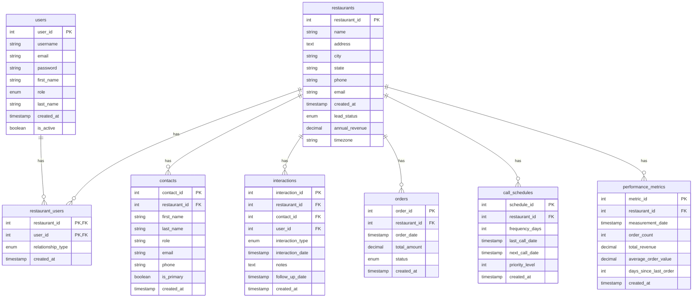

```mermaid
erDiagram
    users ||--o{ restaurant_users : has
    users {
        int user_id PK
        string username
        string email
        string password
        string first_name
        enum role
        string last_name
        timestamp created_at
        boolean is_active
    }

    restaurants ||--o{ restaurant_users : has
    restaurants ||--o{ contacts : has
    restaurants ||--o{ interactions : has
    restaurants ||--o{ orders : has
    restaurants ||--o{ call_schedules : has
    restaurants ||--o{ performance_metrics : has
    restaurants {
        int restaurant_id PK
        string name
        text address
        string city
        string state
        string phone
        string email
        timestamp created_at
        enum lead_status
        decimal annual_revenue
        string timezone
    }

    restaurant_users {
        int restaurant_id PK,FK
        int user_id PK,FK
        enum relationship_type
        timestamp created_at
    }

    contacts {
        int contact_id PK
        int restaurant_id FK
        string first_name
        string last_name
        string role
        string email
        string phone
        boolean is_primary
        timestamp created_at
    }

    interactions {
        int interaction_id PK
        int restaurant_id FK
        int contact_id FK
        int user_id FK
        enum interaction_type
        timestamp interaction_date
        text notes
        timestamp follow_up_date
        timestamp created_at
    }

    orders {
        int order_id PK
        int restaurant_id FK
        timestamp order_date
        decimal total_amount
        enum status
        timestamp created_at
    }

    call_schedules {
        int schedule_id PK
        int restaurant_id FK
        int frequency_days
        timestamp last_call_date
        timestamp next_call_date
        int priority_level
        timestamp created_at
    }

    performance_metrics {
        int metric_id PK
        int restaurant_id FK
        timestamp measurement_date
        int order_count
        decimal total_revenue
        decimal average_order_value
        int days_since_last_order
        timestamp created_at
    }
```